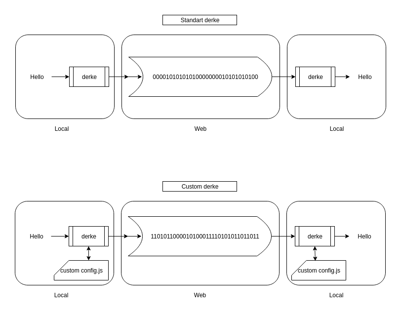

[](https://github.com/veysel/derke)

# derke

Very simple and changeable crypto library for javascript

[](https://www.npmjs.com/package/derke)
[](https://travis-ci.com/veysel/derke)
[](https://codecov.io/gh/veysel/derke)

### Install derke

```
npm install --save derke
```

### Using derke

```javascript
const derke = require("derke");

// Text convert to crypto code
derke.convert("hello"); // 00100000000010000000001000000000100000....

// Crypto code convert to text
derke.reverse(cryptoText); // hello
```

### What is derke?


### What Changeable (Custom derke) ?
lib/config.js file customize.

Old:
```js
{
    key: "a",
    value: "00000000000..."
}
```

Custom:
```js
{
    key: "a",
    value: "00000000000..."
},
{
    key: "ş",
    value: "00000000011..."
}
```

#### Attention Important !
- "key" must be unique
- "value" must be unique
- "key" must be character (so length = 1)
- All "value" lengths must be equal

#### How to test new custom config.js?
```
npm test
```

### Performance derke

- convert average time : 0.160 ms
- reverse average time : 0.70 ms

### Standart character list
|       |       |       |       |       |       |       |       |       |       |
|:-----:|:-----:|:-----:|:-----:|:-----:|:-----:|:-----:|:-----:|:-----:|:-----:|
| 0     | 1     | 2     | 3     | 4     | 5     | 6     | 7     | 8     | 9     |
| -     | .     | ,     | ?     | !     | (     | )     | space | a     | b     |
| c     | d     | e     | f     | g     | h     | i     | j     | k     | l     |
| m     | n     | o     | p     | q     | r     | s     | t     | u     | v     |
| w     | x     | y     | z     | A     | B     | C     | D     | E     | F     |
| G     | H     | I     | J     | K     | L     | M     | N     | O     | P     |
| Q     | R     | S     | T     | U     | V     | W     | X     | Y     | Z     |
| ç     | ğ     | ı     | ö     | ş     | ü     | Ç     | Ğ     | İ     | Ö     |
| Ş     | Ü     | "     | #     | $     | %     | &     | *     | +     | '     |
| /     | :     | ;     | <     | >     | =     | @     | \     | [     | ]     |
| ^     | _     | {     | }     | \|    | ~     | `     | æ     | Æ     | ø     |
| Ø     | å     | Å     | ä     | Ä     | ê     | Ê     | î     | Î     | û     |
| Û     | ẍ     | Ẍ     |