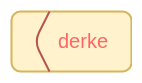

[](https://github.com/veysel/derke)

# derke

Very simple and changeable crypto library for javascript

[](https://www.npmjs.com/package/derke)
[](https://travis-ci.com/veysel/derke)

### Install derke

```
npm install --save derke
```

### Using derke

```javascript
const derke = require("derke");

let text = "hello";

let cryptoText = derke.convert(text);
console.log(cryptoText); // 00100000000010000000001000000000100000....

let pureText = derke.reverse(cryptoText);
console.log(pureText); // hello
```

### Performance derke

- convert average time : 0.160 ms
- reverse average time : 0.70 ms